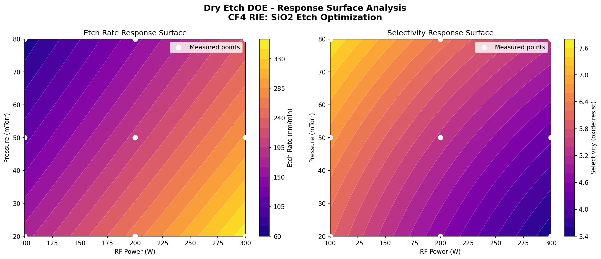
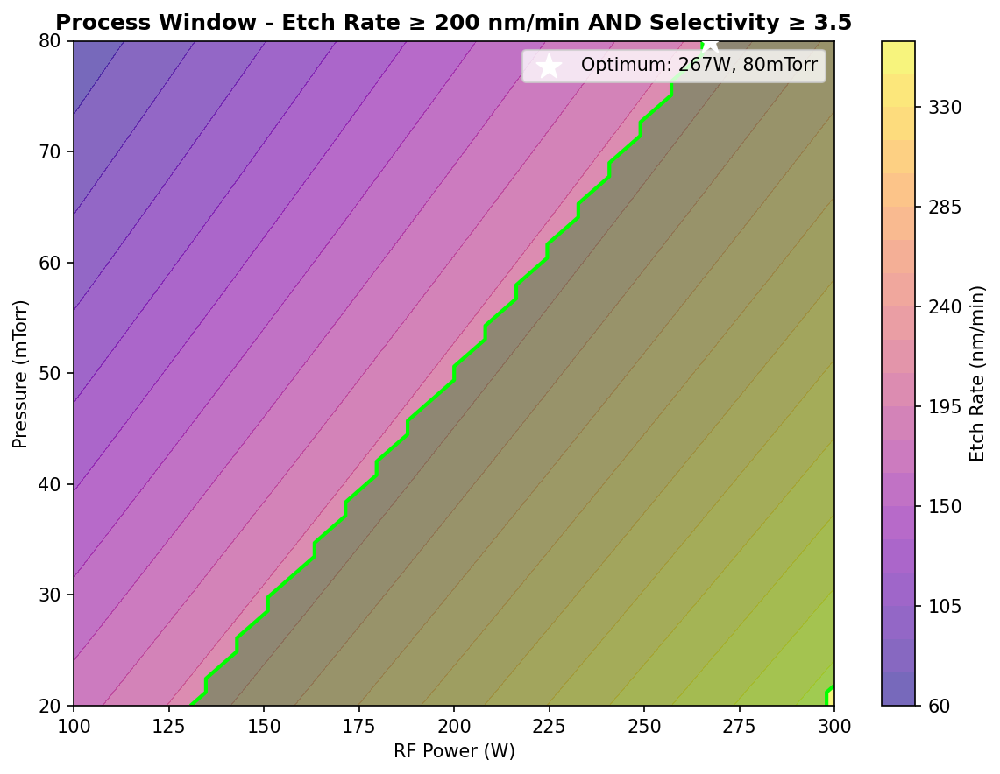

# Dry Etch Process DOE Optimization 

A process parameter optimization study for CF4 reactive ion etching (RIE) of SiO2.
Models the effect of RF power and Chamber Pressure on etch rate (nm/min) and selectivity using a full factorial Design of Experiments (DOE) and response surface methodology. 

## Overview
Real process engineers optimize manufacturing recipes using data. This project mimics that workflow by varying two process parameters systematically across a 3x3 factorial design, fitting a response surface model, then identifying the process window where both outputs meet engineering specifications simultaneously.

## Process Parameters

| Parameter | Range | Physical Effect |
|-----------|-------|-----------------|
| RF Power | 100-300W | Higher power → ions hit harder → faster etch rate, lower selectivity |
| Pressure | 20-80 mTorr | Higher pressure → more collisions → slower etch rate, higher selectivity |

## Methodology 
1. **DOE Grid** - 3x3 full factorial design (9 experiments) across RF Power and Pressure 
2. **Response Surface Model** - 2nd order polynomial with interaction term, fit using NumPy least squares to predict outputs across the full process space
3. **Contour Maps** - separate response surfaces plotted for etch rate and selectivity
4. **Process Window** - region where etch rate ≥ 200 nm/min AND selectivity ≥ 3.5

## Key Concepts 
- Design of Experiment (DOE) - full factorial design
- Response Surface Methodology (RSM)
- Polynomial regression with interaction terms
- Process window definition
- CF4 RIE etch physics - ion bombardment, selectivity, anisotropy

## Technologies Used
- Python 3
- NumPy - polynomial regression, least squares fitting
- Pandas - data structuring
- SciPy - statistical analysis
- Matplotlib - contour map visualization
- Jupyter Notebook - interactive development 

## How to Run
1. Clone this repository
2. Install dependencies: `pip install numpy pandas scipy matplotlib`
3. Open Jupyter Notebook and run `process_DOE_optimization.ipynb`

## Results

### Response Surfaces
Separate contour maps for etch rate and selectivity confirm the core engineering trade off - conditions that maximize one degrade the other.

### Process Window & Optimal Conditions
The green region shows all power/pressure combinations where both specs for etch rate and selectivity are met.
The optimal point maximizes selectivity within the acceptable window.

**Optimal process conditions: 267W, 80 mTorr**

| Output | Optimal Value | Spec | Status |
|--------|---------------|------|--------|
| Etch Rate | ~ 310 nm/min | ≥ 200 nm/min |o |
| Selectivity | ~3.9 | ≥ 3.5 | o | 

## Background
Built to demonstrate process engineering thinking - systematic DOE, data-driven optimization, and process window definition (as applied to dry etch recipe development in semiconductor manufacturing).
